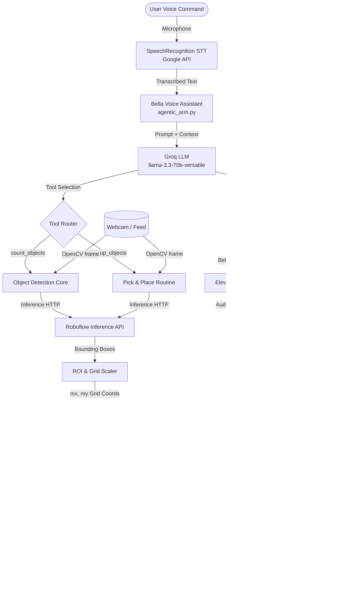

# Ako Buto Robotic Arm Project: Systems & Architecture Documentation

Welcome to the comprehensive documentation of the **Ako Buto 6-DOF Robotic Arm**. This project demonstrates the evolutionary pipeline of bringing physical robotics to life: starting from **simple offline object detection**, advancing to **real-time optimized computer vision**, moving into **autonomous pick-and-place automation**, and finally culminating in an **Agentic, voice-controlled robotic assistant (Bella)** that behaves as a unified AI agent.

---

## 1. System Architecture Overview

The robotic arm system coordinates software reasoning, computer vision APIs, and embedded physical control. The flow of data runs from the user's voice prompt (input) down to the movement of the 6-DOF servos (output).



---

## 2. Evolutionary Phases of the Project

The system is designed in a modular, step-by-step fashion. Each phase builds upon the previous one to add intelligence and autonomy.

### Phase 1: Simple Object Detection
*   **Target Script:** [detect.py](detect.py)
*   **Primary Technology:** Local YOLOv8 PyTorch model (`best.pt` via `ultralytics`).
*   **How it works:** 
    A basic offline command-line tool. It loads a locally trained YOLO model (`.pt`), takes a static source path (image, directory, or video file), executes object detection, and outputs annotated visual predictions to the `runs/detect/predict` directory.
*   **Significance:** Proves the viability of the computer vision model in detecting the specific object classes (seeds/crops) before deployment onto live webcam streams.

### Phase 2: Real-time Live Camera & ROI Optimization
*   **Target Scripts:** [roboflow_live.py](roboflow_live.py) and [onnx_live.py](onnx_live.py)
*   **Primary Technologies:** Roboflow Inference HTTP SDK, local ONNX Runtime (`onnxruntime`), OpenCV, and Supervision.
*   **Key Optimizations:**
    1.  **Region of Interest (ROI) Filtering:** 
        Robotic arms have a limited physical workspace (reach envelope). To prevent the arm from tracking irrelevant objects or background clutter, a visual Region of Interest (ROI) box is drawn onto the frame. Only objects whose center coordinates lie within this designated zone are processed.
    2.  **Crop-Before-Inference (`onnx_live.py`):**
        Instead of running object detection on the entire high-resolution camera feed, the script crops the frame to the ROI *first* and then sends only the cropped sub-image to the ONNX model (`onnx_models/best.onnx`). Resizing the small crop to a standard size (e.g., 320x320) substantially reduces CPU/GPU latency, unlocking high framerates (FPS).

### Phase 3: Autonomous Arm Control (Pick-and-Place Automation)
*   **Target Scripts:** [autonomous_arm.py](autonomous_arm.py), [servo_controller.py](servo_controller.py), and [esp32_servo_receiver.ino](esp32_servo_receiver/esp32_servo_receiver.ino)
*   **Primary Technologies:** Arduino/C++ Embedded, PySerial, OpenCV, and coordinate grid calibration mapping.
*   **How it works:**
    This phase connects vision to mechanical execution.
    1.  The camera captures the scene, detects objects (such as `PEANUT`, `PUMPKIN`, or `SUNFLOWER` seeds), and identifies their pixel coordinates.
    2.  The script translates these pixel coordinates into a scaled grid coordinate $mx \in [1, 14]$ and $my \in [1, 10]$ mapping standard locations on the work surface.
    3.  A calibration grid database [map.csv](map.csv) maps each grid cell to the precise 6-DOF joint angles necessary for the arm to reach that position.
    4.  An autonomous loop is executed: the coordinate is mapped $\to$ joint angles are retrieved from `map.csv` $\to$ commands are sent over Serial $\to$ the arm picks up the object, returns to its starting posture to avoid collision, moves to the class-specific drop container (sorting), releases the object, and returns home.
*   **Calibration Interface:** The Tkinter application [servo_controller.py](servo_controller.py) provides manual slider controls, limits configuration (saved to [calibration.json](calibration.json)), preset configurations (saved to [saved_positions.json](saved_positions.json)), and logging interfaces to populate the coordinate matrix inside `map.csv`.

### Phase 4: Agentic Voice-Controlled Robotic Assistant (Bella)
*   **Target Script:** [agentic_arm.py](agentic_arm.py)
*   **Primary Technologies:** Groq API client (`llama-3.3-70b-versatile`), SpeechRecognition, ElevenLabs API (`eleven_flash_v2_5`), and native Windows voice fallbacks (`pyttsx3`, PowerShell audio).
*   **How it works:**
    Transitions the system into a natural human-interactive agent.
    1.  **Standby & Wake Word:** The program runs a lightweight Google Speech-to-Text loop waiting for the trigger phrase **"Bella"** (accompanied by startup chimes generated via `winsound.Beep`).
    2.  **Reasoning & System Instruction:** The user speaks an unstructured command (e.g., *"Bella, what do you see?"* or *"Bella, please pick up all the pumpkins!"*). This is transcribed and sent to the LLM. The system prompt styles the assistant to identify as "Bella", a friendly, warm, and sweet girly AI assistant. The prompt commands the LLM to refer to the arm's physical structure as **her own body** (first-person speech: *"I've sorted the seeds!"*).
    3.  **Tool / Function Calling:** The LLM does not just chat; it has direct agency over two vital tools:
        *   `count_objects(target_class)`: Triggers a snapshot, runs crop detection, and returns visual stats.
        *   `pick_up_objects(target_class)`: Triggers the physical pick-and-place routine via serial execution.
    4.  **Expressive Speech Synthesis:** Bella reads out the response generated by the LLM. It prioritizes the **ElevenLabs API** using the low-latency Flash model to produce natural inflection, falling back to local offline `pyttsx3` text-to-speech if network access or API credentials are unavailable.

---

## 3. Integration & Data Flow Details

### Bounding Box ROI Mapping Mathematics
When the camera captures a frame of resolution $W \times H$, the ROI box is calculated from the center outwards as a fraction of the frame size:

$$\text{ROI Width Full} = W \times \text{roi\_size}$$

$$\text{ROI Height} = H \times \text{roi\_size}$$

To accommodate mounting offsets and mechanical reach, the visual box is narrowed by 25% on the right (leaving 75% width):

$$\text{ROI Width} = \text{ROI Width Full} \times 0.75$$

The bounding box corners $(x_1, y_1)$ and $(x_2, y_2)$ are established on the image:

$$x_1 = \frac{W - \text{ROI Width Full}}{2}, \quad y_1 = \frac{H - \text{ROI Height}}{2}$$

$$x_2 = x_1 + \text{ROI Width}, \quad y_2 = y_1 + \text{ROI Height}$$

For any detected object with center pixel $(c_x, c_y)$ falling inside the ROI, it is mapped to a grid coordinate $(s_x, s_y)$ relative to a $15 \times 11$ coordinate matrix:

$$s_x = \frac{(c_x - x_1) \times 15}{\text{ROI Width}}$$

$$s_y = \frac{(c_y - y_1) \times 11}{\text{ROI Height}}$$

These scaled points are rounded to the nearest integer and clamped to fit the safe boundaries of the calibration lookup table:

$$m_x = \text{clamp}(\text{round}(s_x), 1, 14)$$

$$m_y = \text{clamp}(\text{round}(s_y), 1, 10)$$

The resulting $(m_x, m_y)$ coordinate forms the lookup key inside [map.csv](map.csv) to retrieve the joint angles `[s0, s1, s2, s3, s4, s5]`.

### Serial Communication Protocol
The controller script and the ESP32 communicate asynchronously via a serial connection over USB.
*   **Baud Rate:** `115200`
*   **Interface Type:** Text-based strings ending with a newline character (`\n`).

#### Command Structures
1.  **Single Servo Command:** Update one specific servo.
    $$\text{"index:angle}\backslash\text{n"}$$
    *Example:* `2:150\n` (moves the Waist servo to 150 degrees).
2.  **Bulk Servo Command:** Update multiple servos simultaneously in a comma-separated list.
    $$\text{"index1:angle1,index2:angle2,index3:angle3,...}\backslash\text{n"}$$
    *Example:* `0:180,1:90,2:150,3:40,4:90,5:0\n` (moves all 6 servos to their starting positions).

#### Servo Index & GPIO Mapping
The mechanical joints are mapped to specific GPIO pins on the ESP32:

| Servo Index | Joint Name | GPIO Pin | Default Angle | Limit Min | Limit Max | Hints & Movement |
| :---: | :---: | :---: | :---: | :---: | :---: | :--- |
| **`0`** | Arm 1 | `15` | `180` | `0` | `180` | `0` = Up, `180` = Down |
| **`1`** | Base | `18` | `90` | `0` | `180` | `0` = Right, `180` = Left |
| **`2`** | Waist | `19` | `150` | `0` | `180` | `0` = Down, `180` = Up |
| **`3`** | Arm 3 | `21` | `40` | `0` | `180` | `0` = Down, `180` = Up |
| **`4`** | Arm 2 | `22` | `90` | `0` | `180` | `0` = Left, `180` = Right |
| **`5`** | Gripper | `23` | `0` | `0` | `180` | `0` = Closed, `30` = Open |

---

## 4. Developer Setup & Deployment Guide

### Prerequisites
1.  Python 3.10+ installed.
2.  Microphone and Speakers connected.
3.  USB Serial Connection to ESP32 (typically `COM9` on Windows; auto-detected if not specified).

### Installation Steps
1.  **Clone the workspace** and navigate to the project directory.
2.  **Install dependencies** using the requirements configuration:
    ```bash
    pip install -r requirements.txt
    ```
3.  **Flash the ESP32 Receiver:**
    Open the Arduino IDE, install the `ESP32Servo` library, load [esp32_servo_receiver.ino](esp32_servo_receiver/esp32_servo_receiver.ino), and compile/upload it to your ESP32.

### Configuration (`.env`)
Create a `.env` file in the project root directory containing the required API keys and endpoint settings:
```ini
# Roboflow API configuration for computer vision
ROBOFLOW_API_URL=https://serverless.roboflow.com
ROBOFLOW_API_KEY=your_roboflow_api_key
ROBOFLOW_MODEL_ID=ako_buto/4

# LLM integration key for agent reasoning
GROQ_API_KEY=your_groq_api_key

# Optional text-to-speech settings
ELEVENLABS_API_KEY=your_elevenlabs_api_key
```

---

## 5. Execution Instructions

### Running GUI Servo Calibration
To calibrate physical coordinates or manually control joint servos, launch the GUI controller:
```bash
python servo_controller.py
```
*   Click **Connect** to mount the serial COM port.
*   Toggle the **Calibration** button to show/hide hardware min/max limits.
*   Click **Save Position** to store joint poses in `saved_positions.json`.

### Running Autonomous Pick-and-Place
To start the continuous visual inspection sorting loop:
```bash
python autonomous_arm.py --interval 5.0 --confidence 0.5
```
*   `--interval`: Duration in seconds between camera visual sweeps (default: `5.0`).
*   `--port`: Serial COM port (e.g. `COM9`). Auto-detects if omitted.

### Running Agentic Voice Control (Bella)
To run the interactive AI-agent loop:
```bash
python agentic_arm.py --camera_index 0 --confidence 0.5
```
*   Wait for the arpeggio chime and say **"Bella"**.
*   After the confirmation sound, issue your voice instruction (e.g., *"Bella, count the objects in my workspace"* or *"Pick up all the sunflowers!"*).
*   To exit, say **"Sleep"** or press `Ctrl + C`.

### Running System Mocks (No Hardware Required)
If you want to test the LLM agent and speech synthesis features without having the physical arm or camera plugged in, use the mock environment script:
```bash
python llm_test.py
```
This script acts as a test bench for agent behaviors. It mocks camera captures and serial signals, printing action summaries to the screen so you can verify Bella's logical reasoning and tool-selection capabilities.
